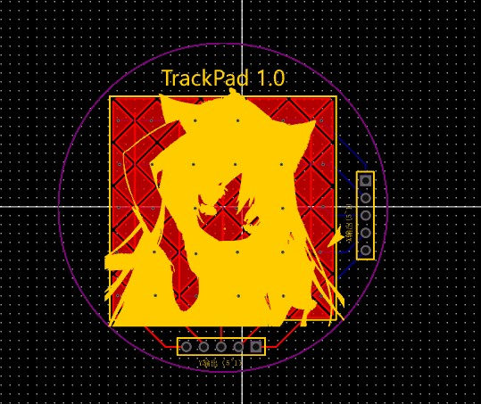

<!--
 * @File: 
 * @Description: 
 * @Author: thoelc
 * @Date: 2023-12-03
 * @LastEditTime: 2023-12-03
 * @LastEditors: Thoelc
 * 
 * Copyright (c) 2023 by ${git_name}, All Rights Reserved. 
-->
# 
 ESP32TouchPad   
  
> &emsp;&emsp;使用ESP32的电容触摸引脚制作5x5分辨率大小的触摸板  
&emsp;&emsp;Make a 5x5 resolution size touchpad using ESP32's capacitive touch pins
## 项目简介  
&emsp;&emsp;基于ESP32-S3、目前使用简单PCB绘制的5x5矩形区域，通过分别读取x和y的5路电容变化量获取触摸位置，通过蓝牙HID实现蓝牙无线触摸板功能。  

  

&emsp;&emsp;V1.0版本原理图很简单，只需要接线到ESP32开发板就能使用、目前软件还存在很多问题